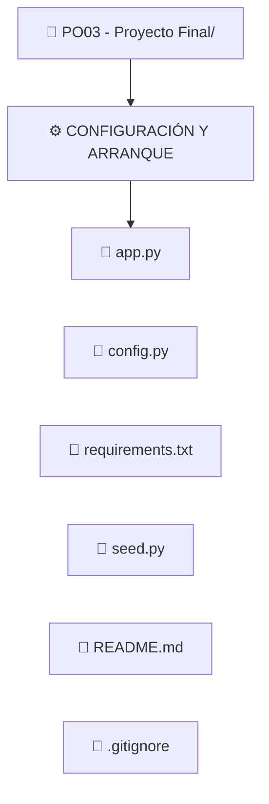

```mermaid
graph TD
    %% Definición de los elementos con sus iconos
    R["📁 PO03 - Proyecto Final/"]
    C1["⚙️ CONFIGURACIÓN Y ARRANQUE"]
    F1["📄 app.py"]
    F2["📄 config.py"]
    F3["📄 requirements.txt"]
    F4["📄 seed.py"]
    F5["📄 README.md"]
    F6["📄 .gitignore"]

    %% Estructura de caídas directas alineadas a la izquierda
    R --> C1
    C1 --> F1
    F1 --- F2
    F2 --- F3
    F3 --- F4
    F4 --- F5
    F5 --- F6

    %% Estilos invisibles para forzar que caigan en lista vertical pura
    linkStyle 2,3,4,5,6 stroke:transparent,stroke-width:0px;
```
