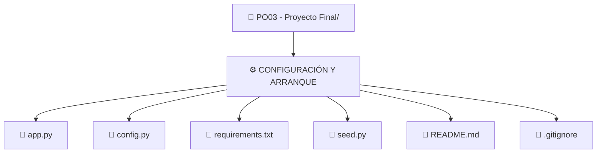

```mermaid
graph TD
    %% Bloque Generado de Carpetas y Archivos en Cascada
    N0["📁 PO03 - Proyecto Final/"]
    N1["⚙️ CONFIGURACIÓN Y ARRANQUE"]
    N2["📄 app.py"]
    N3["📄 config.py"]
    N4["📄 requirements.txt"]
    N5["📄 seed.py"]
    N6["📄 README.md"]
    N7["📄 .gitignore"]

    %% Conexiones automáticas
    N0 --> N1
    N1 --> N2
    N1 --> N3
    N1 --> N4
    N1 --> N5
    N1 --> N6
    N1 --> N7
```
